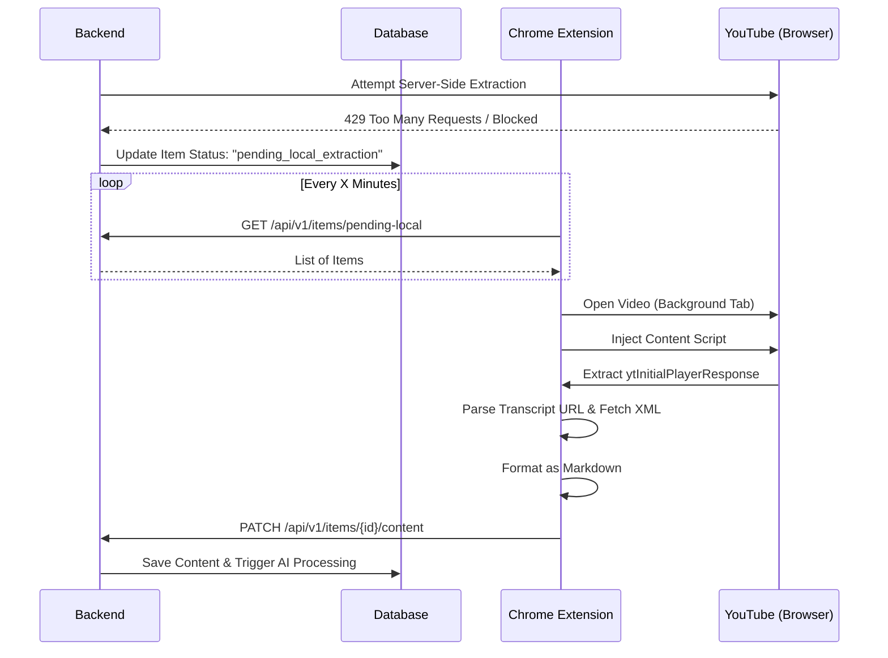

# Client-Side YouTube Transcript Extraction Architecture

## 1. Problem Statement
The production backend is hosted on cloud infrastructure (e.g., DigitalOcean, AWS) which YouTube actively blocks, preventing server-side transcript extraction using `youtube_transcript_api` or `yt-dlp`. To ensure reliable functionality, transcript extraction must be offloaded to the client (Chrome Extension), which operates on the user's residential IP address.

## 2. Architecture Overview

### High-Level Flow
1.  **Detection:** Backend attempts extraction. If blocked, it marks the item as requiring local extraction.
2.  **Polling:** Chrome Extension periodically polls the backend for items marked `pending_local_extraction`.
3.  **Extraction:** Extension opens the YouTube video in a background tab and extracts the transcript directly from the browser session.
4.  **Sync:** Extension uploads the extracted transcript back to the backend.
5.  **Completion:** Backend saves the content and triggers post-processing (embeddings, AI tagging).



## 3. Implementation Details

### A. Backend Modifications

**1. Enhanced Error Detection (`backend/app/services/youtube.py`)**
The current implementation returns `None` for failures. We need to distinguish between "Video not found" (permanent failure) and "Request blocked" (retry locally).

*   **Action:** Introduce a custom exception `YouTubeBlockingError`.
*   **Logic:** If `youtube_transcript_api` raises `VideoUnavailable` or `TranscriptsDisabled`, check the internal cause. If it looks like an IP block (cookies required, sign-in required), raise `YouTubeBlockingError`.

**2. Fallback Logic (`backend/app/services/background.py`)**
*   **Action:** Update `process_item_background`.
*   **Logic:** catch `YouTubeBlockingError` specifically.
    *   If caught, update item status to `pending_local_extraction`.
    *   Do NOT mark as `failed`.

### B. Chrome Extension Modifications

**1. Data Extraction Strategy (`chrome_extension/src/content/content-script.ts`)**
Content scripts run in an "isolated world" and cannot directly access the page's `window.ytInitialPlayerResponse`. We must scrape it from the DOM.

*   **Extraction Logic:**
    1.  Select all `<script>` tags on the page.
    2.  Regex search for `var ytInitialPlayerResponse = ({.*?});`.
    3.  Parse the JSON object.

**2. Transcript Fetching & Parsing**
*   **Locate Track:** Traverse `playerResponse.captions.playerCaptionsTracklistRenderer.captionTracks`.
    *   Filter for `languageCode === 'en'`.
    *   Prioritize manual captions (`kind !== 'asr'`) over auto-generated.
*   **Fetch:** Perform a `fetch()` request to the track's `baseUrl`.
    *   *Note:* Since this runs in the context of `youtube.com`, CORS usually allows fetching from YouTube's API domains. If strictly blocked, message the background script to fetch.
*   **Parse XML:** The transcript comes as XML.
    ```xml
    <transcript>
        <text start="0.5" dur="3.2">Hello world</text>
        ...
    </transcript>
    ```
    *   Use `DOMParser` to parse the XML string.
    *   Iterate through `<text>` nodes to build the transcript.

**3. Formatting**
Replicate the backend's formatting logic to ensure consistency:
*   Group text into paragraphs.
*   Break paragraphs on long pauses (>2s) or max characters (>500).
*   Add metadata header (# Title, **Channel**, etc.).

## 4. Code Structure for Extension

**`chrome_extension/src/lib/youtube-extractor.ts` (New File)**

```typescript
interface CaptionTrack {
  baseUrl: string;
  name: { simpleText: string };
  vssId: string;
  languageCode: string;
  kind?: string;
}

export class YouTubeExtractor {
  
  static async extractTranscript(): Promise<string | null> {
    // 1. Get Player Response
    const playerResponse = this.getPlayerResponse();
    if (!playerResponse) return null;

    // 2. Get Caption Tracks
    const tracks = playerResponse.captions?.playerCaptionsTracklistRenderer?.captionTracks;
    if (!tracks || tracks.length === 0) return null;

    // 3. Find Best English Track
    const bestTrack = tracks.find(t => t.languageCode === 'en' && t.kind !== 'asr') 
                   || tracks.find(t => t.languageCode === 'en');
    
    if (!bestTrack) return null;

    // 4. Fetch & Parse
    const xml = await fetch(bestTrack.baseUrl).then(r => r.text());
    return this.parseTranscriptXml(xml);
  }

  private static getPlayerResponse(): any {
    // Regex scrape from script tags
    // ... implementation ...
  }

  private static parseTranscriptXml(xml: string): string {
    // DOMParser implementation
    // Format to Markdown
    // ... implementation ...
  }
}
```

## 5. Risk Assessment & Mitigation

| Risk | Mitigation |
|------|------------|
| **DOM Structure Changes** | The regex for `ytInitialPlayerResponse` is fairly stable, but YouTube changes it occasionally. We should include fallback to `ytInitialData`. |
| **CORS Blocking** | If `content-script` cannot fetch the transcript URL, delegate the `fetch` to the `background` service worker which has host permissions. |
| **Performance** | Opening tabs consumes memory. The extension currently processes items sequentially (one tab at a time), which is good. We should ensure the tab is closed immediately after extraction. |