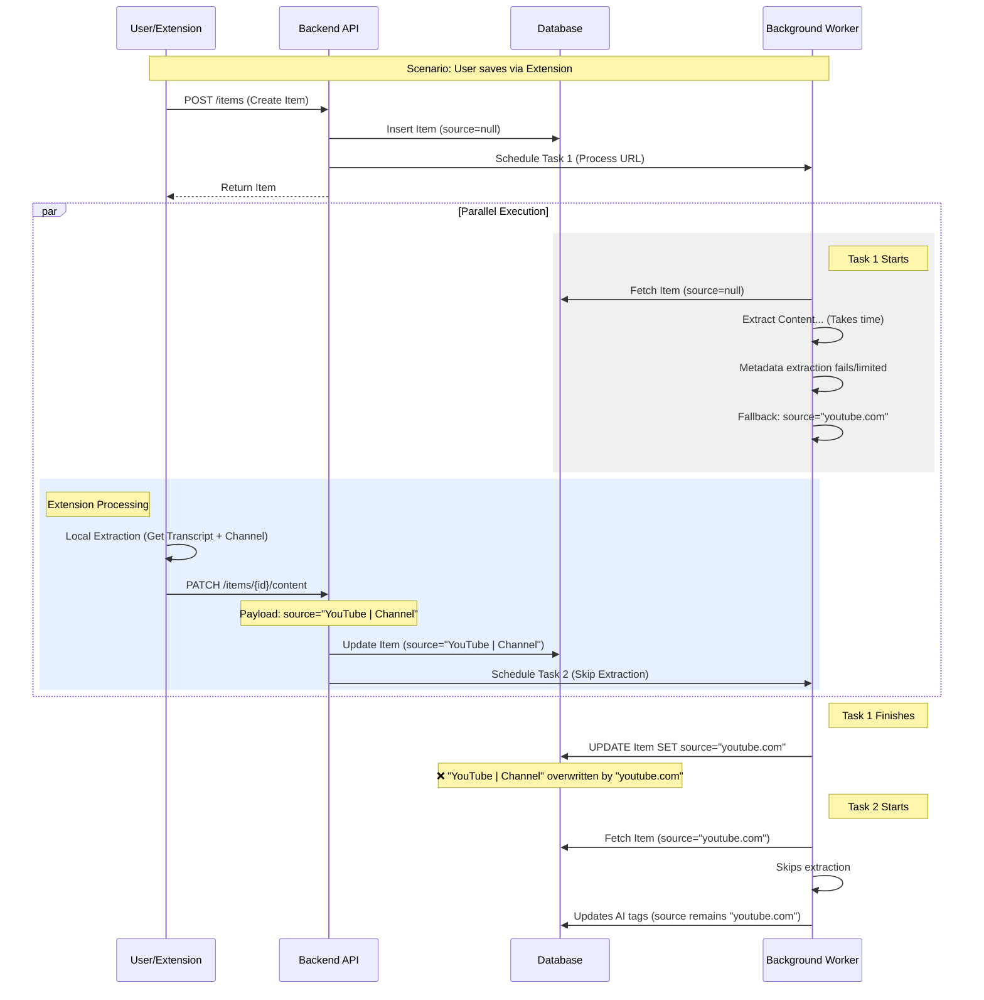

# YouTube Source Metadata Analysis

## 1. Executive Summary

The persistent issue of YouTube videos displaying "youtube.com" instead of "YouTube | [Channel Name]" is caused by a race condition between the initial background processing task and the subsequent update from the Chrome extension (or the timing of the background task itself overwriting data).

Specifically, the background worker uses a cached version of the item (fetched at start of processing) to determine if a source needs to be set. If the Chrome extension updates the source to the correct "YouTube | Channel" format while the background task is running, the background task will not see this change. It will then proceed to "fill in" the missing source using a fallback method (`extract_source_from_url`), which generates "youtube.com", and blindly overwrite the database with this inferior value.

## 2. Source Flow Analysis

### 2.1. The Race Condition

The problem occurs in the following sequence:



### 2.2. Critical Code Paths

#### A. `backend/app/routers/items.py`
- **Creation**: `create_item` correctly leaves `source` as `None` for YouTube URLs to allow background processing to handle it.
- **Upload**: `upload_extracted_content` correctly accepts `source` from the extension and updates the database immediately.

#### B. `backend/app/services/background.py`
This is where the overwriting happens.

1. **Stale Data**: The item is fetched at the very beginning of `process_item_background`:
   ```python
   item_doc = await db.saved_items.find_one({"_id": ObjectId(item_id)})
   ```

2. **The Overwrite Logic**: At the end of the function, it calculates `update_doc`. It checks `item_doc` (the *stale* copy) to see if source is missing:
   ```python
   # Line 533
   if not update_doc.get("source") and not item_doc.get("source") and url:
       update_doc["source"] = extract_source_from_url(url) # Returns "youtube.com"
   ```

3. **Blind Update**: It then executes `update_one` with the `update_doc`, which now contains `source: "youtube.com"`.
   ```python
   await db.saved_items.update_one(
       {"_id": ObjectId(item_id)},
       {"$set": update_doc}
   )
   ```

## 3. Root Cause Identification

1.  **Race Condition**: The background task operates on a stale copy of `item_doc`. It doesn't know that the source has been updated externally (by the extension) during its execution.
2.  **Blind Overwrite**: The `update_one` operation overwrites fields based on the stale logic without checking the current database state.
3.  **Inferior Fallback Priority**: The fallback logic (`extract_source_from_url`) generates a low-quality source ("youtube.com") but is given the power to overwrite potentially high-quality data if the race condition triggers.

## 4. Fix Plan

We need to implement a "Check-Before-Write" strategy in the background worker to ensure we never overwrite a high-quality source with a low-quality one.

### 4.1. Detailed Changes

**File:** `backend/app/services/background.py`

Modify the end of `process_item_background` (around line 533) to:

1.  **Re-fetch the item's source** from the database immediately before finalizing the `update_doc`.
2.  **Compare sources**:
    *   If the DB has a "high-quality" source (contains " | "), **preserve it** (do not include `source` in `update_doc`).
    *   If the DB has a "low-quality" source (e.g. "youtube.com", "YouTube") or no source, and we have a calculated source, allow the update.
    *   Specifically, prevent the fallback `extract_source_from_url` from running if the DB already has a source.

**Pseudocode for Fix:**

```python
# ... (existing processing)

# PRE-UPDATE CHECK: Re-fetch the current source from DB to handle race conditions
current_item_state = await db.saved_items.find_one(
    {"_id": ObjectId(item_id)}, 
    {"source": 1}
)
current_db_source = current_item_state.get("source")

# Determine if we should include source in the update
proposed_source = update_doc.get("source")

# Logic to determine final source
# 1. If DB has high-quality source, KEEP IT (remove from update_doc)
if current_db_source and " | " in current_db_source:
    if "source" in update_doc:
        del update_doc["source"]
# 2. If we don't have a proposed source, try fallback
elif not proposed_source and not current_db_source and url:
    # Only fallback if DB is empty
    update_doc["source"] = extract_source_from_url(url)

# Proceed with update...
```

### 4.2. Why Previous Fixes Failed

1.  **Skipping Source on Creation**: This was correct but insufficient because the background task would eventually fill it in with the fallback value anyway.
2.  **Upload Endpoint Updates**: This was also correct, but the background task (running in parallel) would simply overwrite the result of the upload.

## 5. Testing Strategy

1.  **Simulate Race Condition**:
    *   Start a background task that sleeps for 5 seconds before writing.
    *   While it sleeps, manually update the item's source in the DB to "YouTube | Test Channel".
    *   Verify that when the background task finishes, the source remains "YouTube | Test Channel" and does not revert to "youtube.com".

2.  **Verify Fallback**:
    *   Create an item where extraction fails completely.
    *   Verify it still gets "youtube.com" (better than null).

3.  **Verify Normal Flow**:
    *   Create a YouTube item where backend extraction works.
    *   Verify it gets "YouTube | Channel Name".